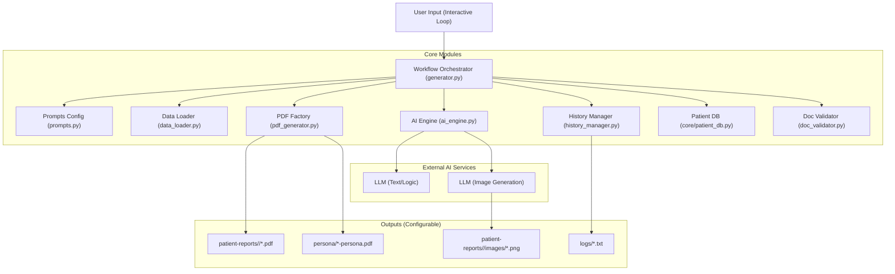

# System Architecture: Clinical Data Generator (v2.0)

## 1. Overview

The Clinical Data Generator is a modular, AI-driven pipeline designed to synthesize high-fidelity synthetic healthcare datasets. It transforms minimal inputs (e.g., "Patient with Knee Pain") into comprehensive Electronic Health Record (EHR) artifacts, including clinical PDF documents and AI-generated medical imaging.

The system utilizes **Generative AI (LLMs)** to ensure clinical logic, data density, and narrative consistency, employing **OpenAI or Google Cloud Vertex AI** for reasoning and **DALL-E 3 / Imagen 3** for medical image synthesis.

## 2. Core Component Interaction



## 3. Module Design & Logic

### A. Workflow Orchestrator (`generator.py`)

This is the entry point. It runs an **Interactive REPL Loop** (`while True`) to process user commands.

* **Initialization**: Loads configuration (`cred/.env`) and database schema.
* **Document Selection**: After Patient ID input, presents menu (default: **Persona + Reports + Summary**).
* **Smart Duplicate Detection**:
  * Scans existing documents in patient folder before generation
  * Extracts document titles from PDF filenames (e.g., "DOC-221-001-CT_Scan.pdf" → "CT_Scan")
  * Creates `existing_docs_map` to track existing documents by title
  * Passes list of existing titles to AI Engine to prevent unnecessary duplicates
  * Only generates multiple reports (e.g., Doc-221-001, Doc-221-002) when test case specifically requires different reports
* **Persona Diversity Logic**:
  * Before processing, fetches **All Existing Patient Names** from `core/patient_db.py`.
  * Passes this list as an `exclusion_list` to the AI Engine to prevent duplicate characters.
* **Artifact Generation**:
  * **Images**: Calls `ai_engine.generate_clinical_image` for relevant document types.
  * **PDFs**: Calls `pdf_generator` to render physical files.
  * **Retry Logic**: If a document fails `doc_validator` checks, it calls `ai_engine` to fix it.

### B. Prompts Configuration (`prompts.py`) ⚡ NEW

Centralized repository for all AI instructions and prompts.

* **Purpose**: Separate AI behavior from code logic for easy customization
* **Key Components**:
  * `SYSTEM_PROMPT` - Core AI role and rules
  * `get_clinical_data_prompt()` - Main document generation instructions
  * `get_image_generation_prompt()` - Medical image synthesis specifications
  * `get_document_repair_prompt()` - Validation fix instructions
  * Helper functions for identity constraints
* **User-Friendly**: Extensive comments and editing guidelines
* **Benefits**: Non-developers can safely customize AI behavior

### C. AI Engine (`ai_engine.py`)

Abstracts all LLM interactions. It uses a **Hybrid SDK Approach**:

* **Configuration**: Loads secrets from `cred/.env`.
* **Prompt Integration**: Imports all prompts from `prompts.py`
* **Persona Logic**:
  * **Universe Selection**: Randomly picks a fictional universe (from `prompts.CHARACTER_UNIVERSES`)
  * **Uniqueness Constraint**: Avoids names in the provided `exclusion_list`.
  * **Feedback Override**: User-requested names override all integrity checks.
* **Logic/Text**: Uses `instructor` wrapped clients for Pydantic-structured outputs.
* **Vision**: Uses DALL-E 3 or Imagen 3 for AI-generated medical images.

### D. PDF Factory (`pdf_generator.py`)

Converts structured data into professional clinical documents using `reportlab`.

* **Features**: HTML Sanitization, Dynamic Templates (Consult vs Lab), AI-generated image embedding
* **Image Strategy**: 100% AI-generated images (no static fallbacks)

### E. Purge Manager (`purge_manager.py`)

Handles data lifecycle and cleanup.

* **Configurable Targets**: Reads `OUTPUT_DIR` from `.env`.
* **Granular Cleaning**: Can purge just documents, just personas, or everything.
* **Safety**: Explicitly verifies paths before destructive operations.

## 4. Developer Guide: How to Make Changes

### How to Customize AI Prompts (Most Common)

1. **Open `prompts.py`** (centralized location for all AI instructions)
2. **Find the relevant function/constant** (e.g., `get_clinical_data_prompt()`)
3. **Read the comments** for guidance on what's safe to change
4. **Make your edits** following the guidelines
5. **Test with TEST_MODE**: Set `TEST_MODE=true` in `.env` for cheaper testing

### How to Add a New Field (e.g., "Blood Type")

1. **Update Data Model**: Open `ai_engine.py` → `PatientPersona`, add `blood_type: str`.
2. **Update Prompt**: Open `prompts.py` → add specific instruction to persona requirements.
3. **Update PDF**: Open `pdf_generator.py` → `create_persona_pdf` to render the new field.

### How to Change the AI Model

1. Open `cred/.env` (provider config).
2. Open `ai_engine.py` and modify `MODEL_NAME`.

### How to Improve Image Quality

1. Open `prompts.py`
2. Find `get_image_generation_prompt()`
3. Read comments for customization tips
4. Add specific requirements (resolution, anatomical details, etc.)

## 5. Directory Structure

```
pdgenerator/
├── cred/                   # Credentials (Ignored by Git)
│   ├── .env                # Config: keys, OUTPUT_DIR
│   ├── gcp_auth_key.json   # Service Account Key
│   └── examples/           # Example configurations (tracked by git)
│       └── .env.example    # Template for setup
├── core/                   # Static reference data & DB Logic
│   ├── UAT Plan.xlsx       # Patient test cases
│   ├── mockdata_schema.sql # Database schema
│   ├── seed_template.sql   # SQL template (legacy/reference)
│   ├── Sample persona.pdf  # Example output
│   ├── patient_db.py       # Patient database module
│   └── patients_db.json    # Central Patient Registry
├── templates/              # Configuration Templates
│   └── summary_template.json
├── generated_output/       # (Default) Dynamic Output Dir
│   ├── persona/            # Generated Personas (.pdf)
│   ├── logs/               # Interaction Logs (.txt)
│   └── patient-reports/    # Clinical Artifacts
│       └── 237/
│           ├── images/     # AI-generated medical images
│           └── *.pdf
├── prompts.py              # ⚡ Centralized AI Prompts & Instructions
├── ai_engine.py            # AI Logic & Pydantic Framework
├── generator.py            # Main Loop & Orchestrator
├── pdf_generator.py        # ReportLab Rendering Logic
├── doc_validator.py        # Document Structure Validator
├── data_loader.py          # Excel case loader
├── history_manager.py      # Conversation tracking
├── purge_manager.py        # Data cleanup utilities
├── AI_CONTEXT.md           # AI Reference Documentation
├── ARCHITECTURE.md         # This file
├── run.bat                 # Windows execution wrapper
└── run.sh                  # Mac/Linux execution wrapper
```

## 6. Recent Architectural Changes

### Removed Standalone Image Generation (Feb 2026)

* Removed AI image generation from document workflow
* Documents no longer include standalone generated images  
* Simplified generation process focuses on text-based clinical documents
* Removed image folder creation and image path handling

### Smart Duplicate Detection (Feb 2026)

* **Document Scanning**: Scans existing PDFs before generation to extract titles
* **Intelligent Prevention**: Prevents creating duplicates like "Doc-221-001 CT scan" and "Doc-221-002 CT scan"
* **AI Integration**: Passes existing document list to AI for smart decision-making
* **Multiple Reports**: Only generates multiple reports when test case specifically requires different reports
* **Tracking Map**: Added `existing_docs_map` to track documents by title for potential replacement

### Updated Default Generation Mode (Feb 2026)

* Changed default from "Summary + Reports" to "Persona + Reports + Summary"
* Reordered menu options for better user experience
* Comprehensive output by default for complete patient records

### Code Cleanup (Feb 2026)

* Removed `patch_prompts.py` and `patch_prompts_v2.py` (obsolete patching code)
* Cleaner, more maintainable codebase

### Centralized Prompts (v2.0)

* Created `prompts.py` to separate AI logic from code
* All prompt strings moved out of `ai_engine.py`
* User-friendly comments and editing guidelines
* Easier maintenance and customization

### Cross-Platform Support

* Added Windows batch script (`run.bat`)
* Platform-specific documentation
* Example configuration files for easy onboarding
