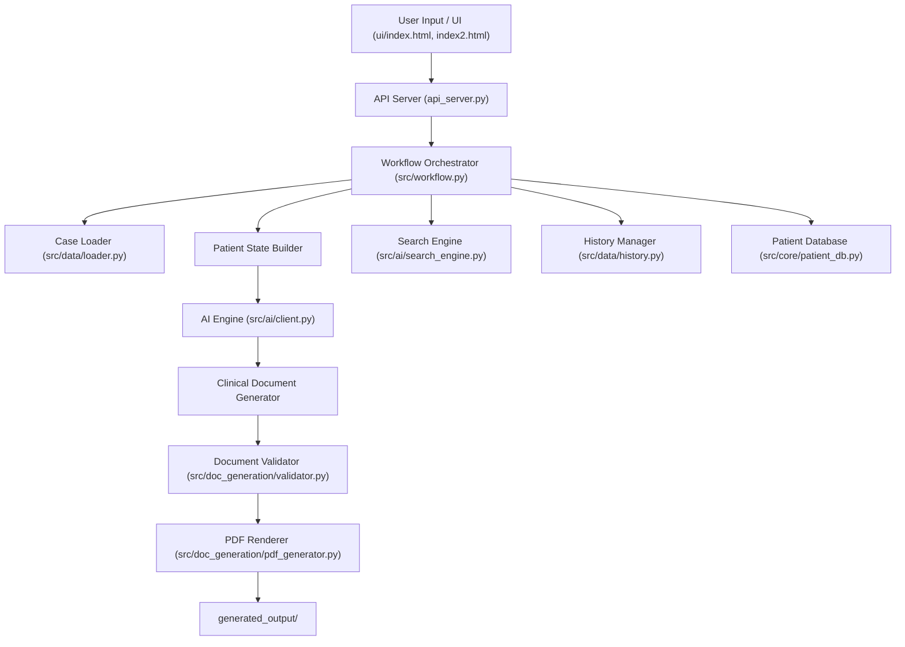

# Clinical Data Generator — System Architecture (v4)

## 1. Overview

The Clinical Data Generator is an AI-driven pipeline that produces realistic synthetic healthcare data for testing Prior Authorization (PA) workflows.

The system generates:

- **Patient Personas**: FHIR-style patient records.
- **Clinical Reports**: Consult notes, imaging reports, and lab reports.
- **Clinical Summaries**: Aggregated case overviews.
- **Policy criteria summaries are not emitted in clinical outputs** (reports/persona); any policy/criteria content is reserved for internal annotator guidance.

Outputs are rendered as structured PDFs designed for OCR evaluation, LLM document understanding, and Prior Authorization testing pipelines.

---

## 2. Core Architectural Principle: Single Source of Truth

All generated documents must derive from a single structured patient record called `patient_state`. This object represents the canonical patient data model and prevents inconsistent patient information across documents.

### Patient State Hierarchy

- `patient_state`
  - `identifiers`
  - `demographics`
  - `providers`
  - `diagnoses`
  - `medications`
  - `encounters`
  - `procedure_request`
  - `facility`

**Constraint**: Every module reads from this object. Documents must never "hallucinate" or invent patient attributes independently.

---

## 3. System Architecture


```mermaid
graph TD
    UI["User Input / UI (ui/index.html, index2.html)"] --> API["API Server (api_server.py)"]
    API --> Generator["Workflow Orchestrator (src/workflow.py)"]
    Generator --> DataLoader["Case Loader (src/data/loader.py)"]
    Generator --> PatientState["Patient State Builder"]
    PatientState --> AIEngine["AI Engine (src/ai/client.py)"]
    AIEngine --> Documents["Clinical Document Generator"]
    Documents --> Validator["Document Validator (src/doc_generation/validator.py)"]
    Validator --> PDFFactory["PDF Renderer (src/doc_generation/pdf_generator.py)"]
    PDFFactory --> Output["generated_output/"]
    Generator --> Search["Search Engine (src/ai/search_engine.py)"]
    Generator --> History["History Manager (src/data/history.py)"]
    Generator --> DB["Patient Database (src/core/patient_db.py)"]
```

---

## 4. Patient State Layer

### Purpose

The Patient State Layer ensures that all documents reference the same patient data, preventing:

- Conflicting demographics
- Mismatched MRNs
- Inconsistent providers
- Timeline drift

### Schema Example

```json
{
  "patient_id": "212",
  "identifiers": {
    "mrn": "MRN-212-2026",
    "insurance_member_id": "MBR-999999",
    "policy_number": "POL-2025-000001"
  },
  "demographics": {
    "name": "Sandor Clegane",
    "dob": "1965-03-23",
    "gender": "Male",
    "height": "6 ft 5 in",
    "weight": "250 lbs"
  },
  "providers": [
    { "name": "Dr Jane Smith", "specialty": "Cardiology", "npi": "1234567890" }
  ],
  "diagnoses": [
    { "code": "I25.10", "condition": "Atherosclerotic heart disease" }
  ],
  "requested_procedure": {
    "procedure_name": "Cardiac CT Angiography",
    "cpt_code": "75574",
    "expected_date": "2026-03-15"
  }
}
```

---

## 5. Generation Workflow

| Step | Phase | Responsibility |
|------|-------|----------------|
| 1 | User Input | Receives Patient ID, feedback, and generation mode |
| 2 | Case Data Loading | Loads context from `core/UAT Plan.xlsx` (diagnoses, procedure requests) |
| 3 | Patient State Construction | Builds `patient_state` from Excel, DB, and AI persona fields |
| 4 | AI Generation | Calls LLM to produce `ClinicalDataPayload` (persona + documents) |
| 5 | Document Validation | `src/doc_generation/validator.py` checks structural integrity |
| 6 | PDF Rendering | Converts validated JSON to PDFs via template-driven layout |
| 7 | Output Storage | Saves artifacts to `generated_output/` with IDs and timestamps |

### Key Data Models (Pydantic)

- **`PatientPersona`**: Full synthetic patient record (demographics, diagnoses, medications, encounters, imaging, labs, etc.)
- **`GeneratedDocument`**: Single clinical document (title, type, content sections).
- **`ClinicalDataPayload`**: Combined persona + documents + changes summary. The `documents` field uses the alias `structured_documents` for AI fidelity; both keys are normalised by `_parse_vertex_response()`.
- **`AnnotatorSummary`**: Post-generation quality summary used for PA optimization scoring.

---

## 6. AI Engine (`src/ai/client.py`)

### LLM Provider Selection

Controlled by `LLM_PROVIDER` in `cred/.env`. Switch between providers without code changes.

| Provider | Production Model | Test Model |
|----------|-----------------|------------|
| `openai` | `gpt-4o` | `gpt-4o-mini` |
| `vertexai` | `gemini-2.5-pro` | `gemini-2.5-flash` |

### Vertex AI Specifics

- Uses `instructor.from_vertexai` with `Mode.VERTEXAI_TOOLS`
- Direct `model_instance.generate_content()` calls (bypasses Instructor for raw JSON control)
- `GOOGLE_APPLICATION_CREDENTIALS` resolved relative to `BASE_DIR` — CWD-independent
- REST transport enforced to prevent gRPC deadlocks on macOS

### Shared Helpers

```python
_strip_json_fences(text)
# Strips ```json / ``` markdown fences from raw model output

_parse_vertex_response(resp, model_class, existing_persona=None)
# Full Vertex response parser:
#   - Strips fences
#   - Unwraps list responses ([{...}] → {...})
#   - Normalises 'documents' → 'structured_documents' key alias
#   - Pydantic model_validate with ValidationError recovery
```

A `vertex_doc_reminder` CRITICAL instruction is always prepended to Vertex prompts to force inclusion of `structured_documents`.

### Output Quality Guards

- **Bio narrative is enforced non-empty**: if the LLM returns a blank or too-short `bio_narrative`, it is backfilled from persona data, encounters, diagnoses, and case details.
- **Report medical history is enforced**: if a document includes `past_medical_history` but it is blank, it is backfilled using supporting diagnoses or case context.
- **No coverage/sufficiency judgments in clinical text**: documents are sanitized to remove explicit appropriateness/coverage or evidence-sufficiency language (e.g., "not indicated", "not medically necessary", "meets criteria", "insufficient evidence").
- **Rejection → Approval for clinical docs**: when supporting reports are generated, rejection/denial case outcomes are converted to approval for clinical document generation (annotator summary can still reflect the original test case).

---

## 7. Temporal Consistency

Medical events follow a realistic clinical timeline relative to the requested procedure date.

| Event | Timeline |
|-------|----------|
| Medical History | 6 months – 5 years before procedure |
| Encounters | 1 – 12 weeks before procedure |
| Lab Tests | 1 – 4 weeks before procedure |
| Procedure | 7 – 90 days in the future |

Utility functions: `calculate_procedure_date()`, `calculate_encounter_date()` in `src/utils/date_utils.py`.

---

## 8. Duplicate Prevention

The system performs a pre-generation scan of existing outputs:

1. Reads files in the patient-specific folder.
2. Extracts existing document titles.
3. Passes titles to the AI engine as an exclusion list.
4. Prevents duplicate titles like `Doc-221-001_CT_Scan.pdf` unless explicitly required.

---

## 9. Modular Components

### AI Prompt Architecture (`src/ai/prompts.py`)

All prompts are centralized for customization and consistency (`SYSTEM_PROMPT`, `get_clinical_data_prompt`, `get_document_repair_prompt`).

### Search Engine (`src/ai/search_engine.py`)

Retrieves external medical coding (CPT/ICD-10) and policy criteria from AAPC/CMS.

- Cache: `.search_cache/`
- TTL: 24 hours

### Externalized Rules (`config/`)

Hardcoded logic is externalized into JSON configs:

- `config/remediation_rules.json`
- `config/sanitization_patterns.json`

### Patient Database (`src/core/patient_db.py`)

Persistent storage of generated personas in `src/core/patients_db.json` to preserve consistency across runs.

Legacy `core/patients_db.json` is automatically migrated into `src/core/patients_db.json` on first load.

### UI Layer (`ui/`)

| File | Theme | Description |
|------|-------|-------------|
| `index.html` | Dark (Material You) | Original Stitch dark design |
| `index2.html` | Light (Command Center) | New Stitch light design |

Both UIs wire dynamically to the API server at `http://localhost:410`.

---

## 10. Directory Structure

```text
pdgenerator/
├── cred/                       # .env and credentials
├── core/                       # Reference data (Excel plan, code maps)
├── config/                     # Externalized rules & patterns
├── templates/                  # PDF and Document templates
├── generated_output/           # Final artifacts
│   ├── persona/
│   ├── patient-reports/
│   ├── summary/
│   └── logs/
├── ui/
│   ├── index.html              # Dark UI (Material You)
│   └── index2.html             # Light UI (Command Center)
├── src/
│   ├── ai/                      # LLM client, prompts, models, QA, search
│   ├── core/                    # Config + patient DB + state (patients_db.json)
│   ├── data/                    # Loader + history + record writers
│   ├── doc_generation/          # Planner, validator, PDF generation
│   ├── utils/                   # File/date/purge utilities
│   ├── cli.py                   # CLI entrypoint
│   └── workflow.py              # Orchestration layer
├── api_server.py                # Flask REST API (port 410)
├── run.py                       # CLI launcher (recommended)
└── remove_persona.py            # Deep persona removal utility
```

---

## 11. Cross-Platform Compatibility

The system supports Windows, macOS, and Linux.

- **Universal Encoding**: All file I/O uses `utf-8`.
- **Path Abstraction**: `os.path.join` + absolute path resolution relative to each script's `__file__` directory. `GOOGLE_APPLICATION_CREDENTIALS` relative paths are resolved against `BASE_DIR` in `src/ai/client.py`.
- **Environment Isolation**: `python-dotenv` loads from `cred/.env`. No `export` prefixes in `.env` values.
- **Entry Points**: `.sh` (Mac/Linux) and `.bat` (Windows) scripts change to the script directory before running — CWD-independent invocation.

---

## 12. Future Extensions

- **Patient State Manager**: A dedicated class to handle state mutations.
- **Timeline Engine**: Deterministic scheduling of all historical medical events.
- **Planning Layer**: A pre-generation step to outline all needed documents before calling the AI.
