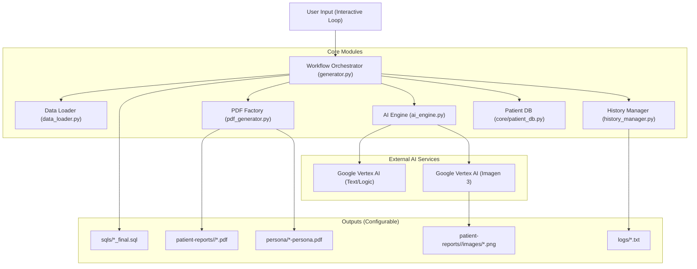

# System Architecture: Clinical Data Generator (v2.0)

## 1. Overview
The Clinical Data Generator is a modular, AI-driven pipeline designed to synthesize high-fidelity synthetic healthcare datasets. It transforms minimal inputs (e.g., "Patient with Knee Pain") into comprehensive Electronic Health Record (EHR) artifacts, including SQL database entries, clinical PDF documents, and medical imaging.

The system utilizes **Generative AI (LLMs)** to ensure clinical logic, data density, and narrative consistency, employing **Google Cloud Vertex AI** (Gemini 2.5 Pro) for reasoning and **Imagen 3** for medical image synthesis.

## 2. Core Component Interaction



## 3. Module Design & Logic

### A. Workflow Orchestrator (`generator.py`)
This is the entry point. It runs an **Interactive REPL Loop** (`while True`) to process user commands.
*   **Initialization**: Loads configuration (`cred/.env`) and database schema.
*   **Persona Diversity Logic**:
    *   Before processing, fetches **All Existing Patient Names** from `core/patient_db.py`.
    *   Passes this list as an `exclusion_list` to the AI Engine to prevent duplicate characters (e.g., no two "Walter Whites").
*   **Optimization**:
    *   **Lazy Loading**: Loads patient DB once.
    *   **In-Memory Caching**: Dynamically tracks generated names to prevent duplicates without re-reading files (O(1)).
*   **Artifact Generation**:
    *   **SQL**: Conditionally writes `_final.sql`.
    *   **Images**: Calls `ai_engine.generate_clinical_image` for relevant document types.
    *   **PDFs**: Calls `pdf_generator` to render physical files.

### B. AI Engine (`ai_engine.py`)
Abstracts all LLM interactions. It uses a **Hybrid SDK Approach**:
*   **Configuration**: Loads secrets from `cred/.env`.
*   **Persona Logic**:
    *   **Universe Selection**: Randomly picks a fictional universe (e.g., *Brooklyn 99*, *Seinfeld*, *Marvel*) to seed the persona.
    *   **Uniqueness Constraint**: Strictly instructed to avoid names in the provided `exclusion_list`.
    *   **Feedback Override**: If user explicitly requests a name (e.g., "Use Tony Stark"), it overrides all integrity checks.
*   **Logic/Text**: Uses `google.genai` SDK with `instructor` for Pydantic-structured outputs.
*   **Vision**: Uses `vertexai.vision_models` for Imagen 3 image synthesis.

### C. PDF Factory (`pdf_generator.py`)
Converts structured data into professional clinical documents using `reportlab`.
*   **Features**: HTML Sanitization, Dynamic Templates (Consult vs Lab), and Image Embedding.

### D. Purge Manager (`purge_manager.py`)
Handles data lifecycle and cleanup.
*   **Configurable Targets**: Reads `OUTPUT_DIR` from `.env`.
*   **Granular Cleaning**: Can purge just documents, just personas, or everything.
*   **Safety**: Explicitly verifies paths before restrictive `rm -rf` operations.

## 4. Developer Guide: How to Make Changes

### How to Add a New Field (e.g., "Blood Type")
1.  **Update Data Model**: Open `ai_engine.py` -> `PatientPersona`, add `blood_type: str`.
2.  **Update Prompt**: In `ai_engine.py`, add specific instruction to `CORE_PROMPT`.
3.  **Update PDF**: Open `pdf_generator.py` -> `create_persona_pdf` to render the new field.

### How to Change the AI Model
1.  Open `cred/.env` (provider config).
2.  Open `ai_engine.py` and modify `MODEL_NAME` (e.g., change `"gemini-2.5-pro"` to `"gemini-1.5-pro"`).

## 5. Directory Structure
```
pdgenerator/
├── cred/                   # Credentials (Ignored by Git)
│   ├── .env                # Config: keys, OUTPUT_DIR
│   └── gcp_auth_key.json   # Service Account Key
├── core/                   # Static assets & DB Logic
│   ├── patients_db.json    # Central Patient Registry
│   └── seed_template.sql   # Base SQL
├── generated_output/       # (Default) Dynamic Output Dir
│   ├── persona/            # Generated Personas (.pdf)
│   ├── sqls/               # Generated SQLs (.sql)
│   ├── logs/               # Interaction Logs (.txt)
│   └── patient-reports/    # Clinical Artifacts
│       └── 237/
│           ├── images/
│           └── *.pdf
├── ai_engine.py            # AI Logic & Pydantic Framework
├── generator.py            # Main Loop & Orchestrator
├── pdf_generator.py        # ReportLab Rendering Logic
└── run.sh                  # Execution Wrapper
```
